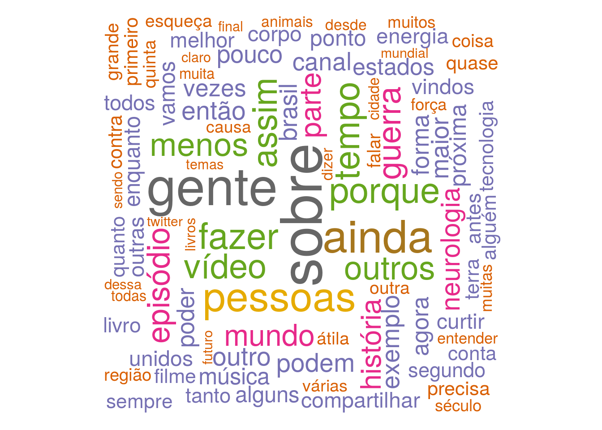

```{r, echo=FALSE}
load('../Raw_files/all_vid_nerdologia.RData')
load('../Raw_files/html_page.RData')
load('../Raw_files/html_page_text.RData')
```


<style>
body {
text-align: justify}
</style>


<style type1 text/css'>
h1.title {
  text-align: center;
}
h4.author { 
  text-align: center;
}
h4.date { 
  text-align: center;
}
</style>

<style type='text/css'>
body{ /* Normal  */
  font-size: 14px;
  
td {  /* Table  */
  font-size: 14px;
}
h1.title {
  font-size: 24px;

}
h1 { /* Header 1 */
  font-size: 24px;

}
h2 { /* Header 2 */
    font-size: 16px;
}
h3 { /* Header 3 */
  font-size: 14px;

}
code.r{ /* Code block */
    font-size: 14px;
}
pre { /* Code block - determines code spacing between lines */
    font-size: 14px;
}
</style>

```{r setup, include=FALSE}
knitr::opts_chunk$set(echo = TRUE)
```
<p align='center'> 

</p>


## 1.Introdução

<p align='justify'> 
Abordarei neste tópico uma forma de explorar informações contidas em um determinado canal do Youtube. Como exemplo, estarei demonstrando a obtenção e análise dos dados proveniente do canal "Nerdologia", dos autores Atila Iamarino e Filipe Figueiredo. Os dados manipulados servem como base para a apresentação gráfica em um dashboard dinâmico, desenvolvido em Shiny (linguagem R). Por hora, proponho a análise quantitativa de métricas como visualizações, likes, dislikes e comentários. Bem como a análise textual das legendas geradas automaticamente pelo sistema do Youtube (quando habilitado pelo(s) autor(es) do canal).

Infelizmente o acesso ao texto completo dos comentários é limitado pela API do Youtube, portanto eles não foram analisados (motivos financeiros). A motivação  para este estudo é meramente e unicamente por uma questão de curiosidade e pelo exercício da criatividade. Bem como uma forma divertida de se aperfeiçoar cada vez mais nas ferramentas da linguagem R (programação, métodos de exploração de dados, desenvolvimento de dashboards, etc.).
</p>

## 2.Metodologia

Primeiramente foi realizada a extração dos dados brutos. Para as métricas quantitativas, utilizei a API do Youtube (necessita de cadastro prévio) via pacote **tuber** do R. As legendas automáticas foram baixadas usando o pacote **RCurl** juntamente com a ferramenta online **diycaptions** (  http://diycaptions.com).

Os dados textuais foram processados pelas funções do pacote **tm** e visualizados usando a ferramenta **wordcloud**.  No caso das métricas quantitativas do canal, os dados foram visualizados pela ferramenta **plotly**. A visualização foi realizada dentro de um dashboard desenvolvido em shiny.

<p align='center'> 

<p/> 


Carregando as bibliotecas

```{r, message=FALSE}
library(rvest)
library(ggplot2)
library(dplyr)
library(tidyr)
library(lubridate)
library(plotly)
library(tuber)
library(stringr)
library(tm)
library(wordcloud)  
library(RCurl)
library(VennDiagram)
library(kableExtra)
```

### 2.1.Extraindo métricas do canal

Primeiramente precisamos fazer a autenticação da nossa conta para poder acessar os dados do Youtube. É preciso realizar um cadastro prévio no site e fazer a requisição de chave de acesso (https://developers.google.com/youtube/v3/).

```{r, eval=FALSE}
client_id <- 'xxxxxxxx' 
key <- 'xxxxxxxx'

yt_oauth(client_id, key)
```

Agora podemos extrair os dados dos canal alvo, usando o ID dele. Caso não saiba onde encontrar esta informação, é aquela série de caracteres na URL (conforme destacado na figura).
 <p align='center'> 

 </p>
 
```{r, eval=FALSE}
all_vid_nerdologia <- get_all_channel_video_stats(channel_id= 'UClu474HMt895mVxZdlIHXEA', mine= FALSE)
```

Precisamos formatar ele adequadamente, formatando os tipos de variáveis bem como fazendo uma limpeza na variável dos títulos.

```{r, eval=TRUE}
# Dates
date_split_list <- strsplit(x= as.character(all_vid_nerdologia$publication_date), split= 'T')
date_split_list <- lapply(date_split_list, function(x){x[1]}) %>% unlist()
all_vid_nerdologia['publication_date'] <- date_split_list
all_vid_nerdologia$publication_date <- as.Date(all_vid_nerdologia$publication_date)

# Variable class
all_vid_nerdologia$viewCount <-  as.numeric(all_vid_nerdologia$viewCount)
all_vid_nerdologia$likeCount <- as.numeric(all_vid_nerdologia$likeCount)
all_vid_nerdologia$dislikeCount <- as.numeric(all_vid_nerdologia$dislikeCount)
all_vid_nerdologia$favoriteCount <- as.numeric(all_vid_nerdologia$favoriteCount)
all_vid_nerdologia$commentCount <- as.numeric(all_vid_nerdologia$commentCount)

# Cleanning data title
all_vid_nerdologia$title <- gsub('\\s\\|\\s.*$', '', all_vid_nerdologia$title)
```

#### Top 10 vídeos com mais Likes
```{r}
all_vid_nerdologia %>%
    arrange(desc(likeCount)) %>%
    head(10) %>%
    select(title, likeCount, dislikeCount, commentCount) %>%
    kable("html") %>% 
    kable_styling("striped", full_width= F) %>%
    column_spec(1:4, bold= T) %>%
    row_spec(1:10, bold= T, color= "white", background= "#3399ff")

```


#### Top 10 vídeos com mais Dislikes
```{r}
all_vid_nerdologia %>%
    arrange(desc(dislikeCount)) %>%
    head(10) %>%
    select(title, dislikeCount, likeCount, commentCount) %>%
    kable("html") %>% 
    kable_styling("striped", full_width= F) %>%
    column_spec(1:4, bold= T) %>%
    row_spec(1:10, bold= T, color= "white", background= "#ff3333")

```

#### Top 10 vídeos com mais comentários
```{r}
all_vid_nerdologia %>%
    arrange(desc(commentCount)) %>%
    head(10) %>%
    select(title, commentCount, dislikeCount, likeCount) %>%
    kable("html") %>% 
    kable_styling("striped", full_width= F) %>%
    column_spec(1:4, bold= T) %>%
    row_spec(1:10, bold= T, color= "white", background= "#4d9900")

```

Agora, deixarei salvo o objeto da tabela processada, para carregar dentro do meu dashboard.

```{r, eval=FALSE}
save(file= 'all_vid_nerdologia.RObj', all_vid_nerdologia)
```

### 2.1.Extraindo dados textuais das legendas e formatando

A função do pacote tuber que realiza a extração das legendas não está funcionando mais, por isso eu optei por um modo semi-rudimentar para fazer isso (porque demora um pouco :/).
Tive que colocar um delay de 30 segundos em cada requisição pois se formos muito rápido acabamos tendo a conexão interrompinda.

```{r, eval=FALSE}
url_request <- paste0('http://diycaptions.com/php/get-automatic-captions-as-txt.php?id=',  all_vid_nerdologia$id, '&language=asr')     

html_page <- list()

for(i in 1:length(url_request) ){
    
    html_page[i] <- getURL(url_request[i])
    
    Sys.sleep(30)
}

save(file= 'html_page.RObj', html_page)
```

Agora farei o pré-tratamento dos dados textuais e a limpeza propriamente dita

```{r, eval=TRUE}
# Removing tags blocks
html_page_text <- lapply(html_page, function(x){
    
    split_1 <- strsplit(x[[1]], '<br><br>')[[1]][2]
    strsplit(split_1[[1]], '\t\t</div>')[[1]][1]
    
})

# Saving object for individual process
# save(file = 'html_page_text.RData', html_page_text)

# Generating corpus text for all avaiable data
text_df_total <- data.frame(doc_id= all_vid_nerdologia$id, text= unlist(html_page_text), stringsAsFactors= FALSE , drop=FALSE)

text_corpus_df <- Corpus(DataframeSource(text_df_total))

text_corpus_df_filtered <- text_corpus_df %>%
    tm_map(stripWhitespace)  %>%    
    tm_map(removePunctuation) %>%                              
    tm_map(removeNumbers)   %>%                               
    tm_map(removeWords, c(stopwords("portuguese"))) %>%  
    tm_map(removeNumbers) %>%  
    tm_map(stripWhitespace) %>%    
    tm_map(content_transformer(tolower))

# Creanting a term matrix
corpus_tf <- TermDocumentMatrix(text_corpus_df_filtered)

corpus_m <- as.matrix(corpus_tf)

corpus_m_sorted <- sort(rowSums(as.matrix(corpus_m)), decreasing= TRUE)

df_total <- data.frame(word= names(corpus_m_sorted), freq= as.numeric(corpus_m_sorted))

df_total$word <- as.character(df_total$word)

df_total <- df_total[which(nchar(df_total$word) > 4), ]

```

O gráfico de frequência total das palavras também deverá aparecer. Porém, lá na ferramenta irei adicionar mecanismos de controle de filtro.

```{r, eval=FALSE}

wordcloud(df_total$word, df_total$freq, min.freq= 10, max.words= 150, random.order= FALSE, rot.per= 0.35, colors=brewer.pal(8, "Dark2"))

```

<p align='center'> 

<p/>

Farei também uma word cloud para os títulos dos vídeos postados

```{r, out.width='100%', out.height='100%'}
text_df_total <- data.frame(doc_id= all_vid_nerdologia$title, text= all_vid_nerdologia$title, stringsAsFactors= FALSE , drop=FALSE)

text_corpus_df <- Corpus(DataframeSource(text_df_total))

text_corpus_df_filtered <- text_corpus_df %>%
    tm_map(stripWhitespace)  %>%    
    tm_map(removePunctuation) %>%                              
    tm_map(removeNumbers)   %>%                               
    tm_map(removeWords, c(stopwords("portuguese"))) %>%  
    tm_map(removeNumbers) %>%  
    tm_map(stripWhitespace) %>%    
    tm_map(content_transformer(tolower))

# Creanting a term matrix
corpus_tf <- TermDocumentMatrix(text_corpus_df_filtered)

corpus_m <- as.matrix(corpus_tf)

corpus_m_sorted <- sort(rowSums(as.matrix(corpus_m)), decreasing= TRUE)

df_total <- data.frame(word= names(corpus_m_sorted), freq= as.numeric(corpus_m_sorted))

df_total$word <- as.character(df_total$word)

df_total_titulo <- df_total[which(nchar(df_total$word) > 2), ]

wordcloud(df_total_titulo$word, df_total_titulo$freq, min.freq= 2, max.words= 100, random.order= FALSE, rot.per= 0.35, colors=brewer.pal(8, "Dark2"))


```


O gráfico do dashboard deve ser similar a este, porém, responsivo com mais informações e opções de filtro.

```{r,  eval=TRUE, out.width='100%', out.height='60%'}
all_vid_nerdologia %>%
    mutate(proportion_like= likeCount / viewCount,
           proportion_dislike= dislikeCount / viewCount) %>%
    arrange(publication_date) %>%
    plot_ly() %>%
    add_trace(x= ~publication_date, y= ~viewCount, 
              name= 'View count', type= 'scatter', 
              mode="markers+lines", text= ~paste('Video: ', title),
              line= list(color= '#440154FF ', width= 4)) %>%
    add_trace(x= ~publication_date, y= ~likeCount, 
              name= 'Like count', type= 'scatter',
              mode="markers+lines", text= ~paste('Video: ', title),
              line= list(color= '#39568CFF', width= 4)) %>%
    add_trace(x= ~publication_date, y= ~dislikeCount,
              name= 'Dislike count', type= 'scatter', 
              mode= "markers+lines", text= ~paste('Video: ', title),
              line= list(color = '#29AF7FFF', width= 4)) %>%
    add_trace(x= ~publication_date, y= ~commentCount,
              name= 'Comment count', type= 'scatter', 
              mode= "markers+lines", text= ~paste('Video: ', title),
              line= list(color= '#FDE725FF', width= 4)) %>%
    layout(xaxis= list(title= "Video publication date"),
           yaxis= list (title= "Metric's count"),
           font=  list(size= 16),
           hovermode= 'compare')

```


